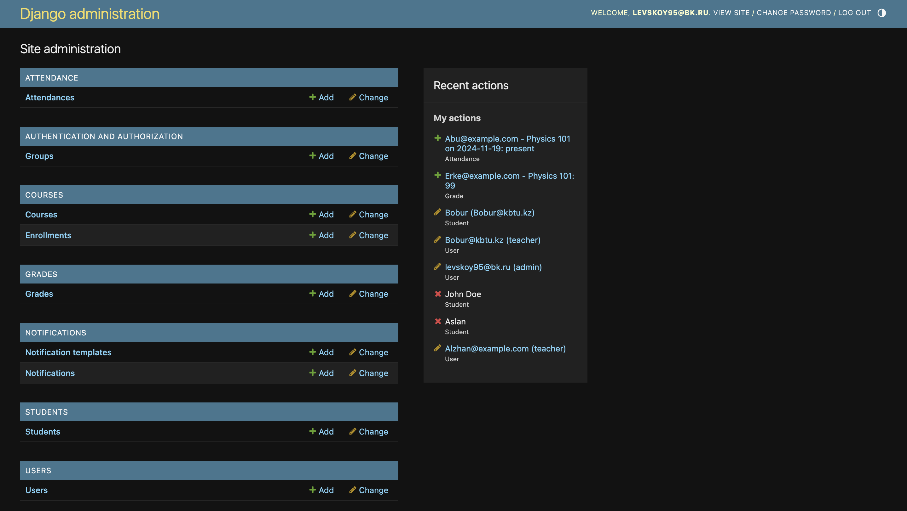
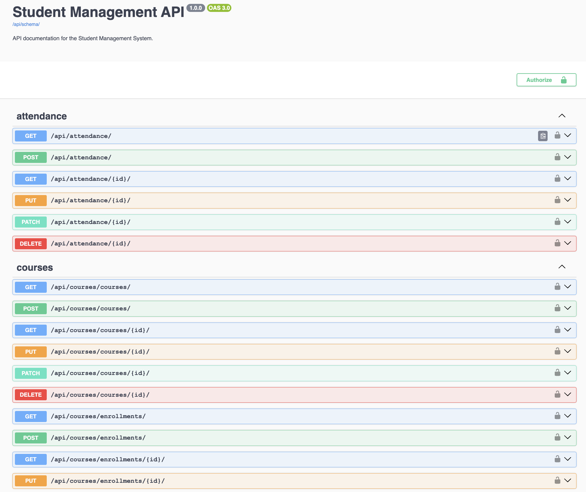

# University Management System

## Project Overview
The **University Management System** is a web application for managing university processes. This project helps to organize users, students, courses, grades, attendance, and notifications. It uses Django and Django Rest Framework (DRF) to create APIs. Technologies like Redis and Celery are used to make the system fast and reliable.

---

## Features

### 1. **User Management**
   - Register, log in, and log out users.
   - User roles: Student, Teacher, Admin.
   - Access control based on roles.

### 2. **Students**
   - Manage student profiles (name, email, birthdate).
   - Admins manage all students. Students can only see their profiles.

### 3. **Courses**
   - Teachers can create and edit courses.
   - Students can enroll in courses.
   - Admins can view all courses.

### 4. **Grades**
   - Teachers assign grades to students for their courses.

### 5. **Attendance**
   - Mark student attendance for courses.
   - View attendance records.

### 6. **Notifications**
   - Admins create notifications for students and teachers.
   - Notifications for grades, attendance, and reminders.

### 7. **Caching**
   - **Redis** caches data like course lists and student profiles for faster loading.

### 8. **Logging**
   - Logs important actions like logins, updates, and notifications.

### 9. **Async Tasks**
   - **Celery** runs background tasks:
     - Send attendance reminders.
     - Notify students about new grades.

### 10. **API Documentation**
   - View API documentation using Swagger and Redoc.

---

## Technologies

- **Backend**: Django, Django Rest Framework
- **Database**: SQLite
- **Caching**: Redis
- **Async Tasks**: Celery
- **API Docs**: drf-spectacular (Swagger/Redoc)

---

## Links

- **Swagger UI**: [http://127.0.0.1:8000/api/docs/](http://127.0.0.1:8000/api/docs/)
- **Redoc UI**: [http://127.0.0.1:8000/api/redoc/](http://127.0.0.1:8000/api/redoc/)
- **Admin Panel**: [http://127.0.0.1:8000/admin/](http://127.0.0.1:8000/admin/)

---

## Screenshots

### 1. Admin Panel
Manage users, courses, and grades in the admin interface.



### 2. Swagger Documentation
Explore API endpoints with Swagger.



1. **Run the server**:
   ```bash
   python manage.py runserver